# 逆水寒帮会联赛数据分析平台：开发说明

> 文档版本：1.5-final  
> 编制日期：2026-06-24  
> 产品形态：Docker 部署的 Web 应用  
> 当前状态：全部核心业务口径已确认，包括职业评分、六维范围初始化、单场与多场排名、随机管理员密码，可直接进入开发

---

## 1. 文档目的

本文件用于后续产品、设计、前端、后端、测试和部署沟通，统一以下内容：

1. 联赛 CSV 的导入与清洗规则；
2. 本帮会个人排名、各团内部 TOP3、团队数据对比；
3. 本帮会与对手帮会的横向对比、优势与不足分析；
4. 按职业差异化计算个人综合排名；
5. 登录、历史记录、设置、评分规则管理；
6. Web 技术架构、PostgreSQL/Redis 数据结构、接口边界和 Docker 独立部署方式；
7. 粉色可爱视觉规范、页面设计图、背景和图标切图；
8. 已确认业务口径、默认实现与未来扩展边界。

本文中的“团队”默认指 CSV 字段 **`所在团长`** 所代表的分团；“团队排名”按照已确认的含义，统一命名为 **“团内 TOP3”**，即每一个分团分别展示本团综合得分最高的三名个人，而不是给各分团排 1、2、3 名。

---

## 2. 已确认需求

### 2.1 产品与部署

- 开发为浏览器访问的 Web 应用，不再开发 Windows 桌面客户端。
- 使用 Docker 部署。
- 技术栈参考 `sub2api` 的工程路线：后端采用 Go + Gin + Ent，前端采用 Vue 3 + Vite + TailwindCSS。
- 数据库参考 `sub2api` 使用 PostgreSQL 15+，缓存、会话、限流和导入预览缓存使用 Redis 7+。
- PostgreSQL 与 Redis 默认由本项目 Docker Compose 独立启动，使用独立网络、独立卷、独立容器名和独立 compose project，不复用服务器已有数据库或缓存服务。
- 提供登录功能。
- 首次部署自动创建管理员账号 `admin`。
- 暂不提供注册、普通用户创建和公开访问功能。
- 页面采用可爱、柔和、清晰的粉色主题。

### 2.1.1 技术栈与自动化安装调整

本项目开发计划已从早期 MVP 的 FastAPI/React/SQLite 方案调整为参考 `sub2api` 的 Go/Vue/PostgreSQL/Redis 方案。旧方案仅作为归档参考，不再作为正式交付目标。

正式交付目标：

| 层级 | 技术选择 | 说明 |
|---|---|---|
| 后端 | Go + Gin + Ent | Gin 提供 HTTP API，Ent 维护领域模型和数据访问边界 |
| 前端 | Vue 3 + TypeScript + Vite + TailwindCSS | 实现设计稿中的后台应用界面、图表和导入流程 |
| 数据库 | PostgreSQL 15+ | 保存用户、会话索引、帮会、比赛、玩家、统计、评分规则、范围版本、头像和导入日志 |
| 缓存 | Redis 7+ | 用于登录会话、登录失败限流、CSV 预览短期缓存和后续后台任务队列 |
| 部署 | Docker Compose | 默认启动 app/postgres/redis 三个独立服务，宿主机默认只暴露 `APP_PORT=18080` |
| 安装 | `scripts/install.sh` | 参考 `sub2api` 的一键脚本体验，自动生成 `.env`、随机密钥、systemd 服务并启动 Compose |

安装脚本必须满足：

1. 不要求宿主机已有 PostgreSQL 或 Redis；
2. 不复用其他项目的 Docker 网络、卷、容器名或 compose project；
3. 自动生成 `POSTGRES_PASSWORD`、`SESSION_SECRET` 等敏感配置；
4. 创建 systemd 服务时只管理本项目目录下的 Compose；
5. 默认保留数据，卸载时只有显式确认才删除数据卷或安装目录；
6. 当前本地没有部署环境，本轮开发只做源码、配置、文档和脚本交付，不执行编译运行。

### 2.2 数据与分析

- 一份导入文件同时包含本帮会和对手帮会的数据。
- 导入预览自动识别两个帮会，由管理员选择哪一方是本帮会；系统记住最近选择作为下次默认值。
- 系统既统计本帮会，也使用同一份文件中的对手数据进行总量、人均、同职业和分团横向对比，自动分析优势与不足。
- 个人基础字段包括：击败、助攻、对玩家伤害、对建筑伤害、治疗值、承受伤害、青灯焚骨、化羽、控制。
- “人头比”正式采用 **KDA =（击败 + 助攻）÷ max(重伤, 1)**；K/D 不再作为主展示或默认排名指标。
- 参团率正式采用 **`(击败 + 助攻) ÷ 所在帮会总击败`**。
- 玩家伤害转化率、拆塔伤害转化率不再等同于个人伤害占帮会总伤害的比例，而是按该职业配置的指标范围转换为 0～100 的标准化表现；伤害占比作为另一项独立展示数据保留。
- 每个职业拥有六个可配置分析维度。每个维度可设置指标、下限、上限、方向和是否参与综合分；未参与综合分的维度仍可用于个人六维雷达分析。
- 综合排名只使用该职业启用且权重大于 0 的维度，各职业权重可以在设置页调整并版本化。
- 职业六维范围首次初始化时，优先使用本次导入文件中双方帮会的同职业样本生成建议；样本充足时采用 P5/P95，样本不足时采用最小值/最大值并增加安全余量。建议范围必须由管理员确认发布，发布后固定，不随新比赛自动漂移。
- 个人排名同时支持单场榜和多场历史总榜。多场榜默认按场均综合分排序，最低参赛场次可筛选，累计贡献分仅作为辅助指标。
- 提供个人六维分析：个人值、六维得分、同职业本帮平均、同职业对手平均、同职业百分位、优势与不足说明。
- 提供各分团数据对比；每个分团按照 CSV 的 `所在团长` 分组，并显示综合得分前三的个人。
- 本帮会和对手帮会均可查看个人排行、团内 TOP3 和团队汇总。
- 玩家头像首次由系统按玩家生成稳定的随机头像；设置页支持上传或替换玩家头像，并提供职业默认头像兜底。

### 2.3 已确认职业综合分权重

| 职业 | 参与综合分的指标与权重 | 状态 |
|---|---|---|
| 素问 | 治疗值 55%、承受伤害 25%、化羽 20% | 已确认 |
| 铁衣 | 控制 60%、承受伤害 40% | 已确认 |
| 神相 | 对玩家伤害 50%、对建筑伤害 50% | 已确认 |
| 血河 | 对玩家伤害 50%、对建筑伤害 50% | 已确认 |
| 沧澜 | 对玩家伤害 50%、对建筑伤害 50% | 已确认 |
| 玄机 | 对玩家伤害 50%、对建筑伤害 50% | 已确认 |
| 云瑶 | 对玩家伤害 50%、对建筑伤害 50% | 已确认 |
| 碎梦 | 击败 50%、对玩家伤害 30%、对建筑伤害 20% | 已确认 |
| 九灵 | 青灯焚骨 60%、对玩家伤害 20%、对建筑伤害 20% | 已确认 |
| 鸿音 | 控制 55%、治疗值 45% | 已确认 |
| 潮光 | 对玩家伤害 50%、对建筑伤害 50% | 已确认，参照神相评分模板 |
| 荒羽 | 对玩家伤害 50%、对建筑伤害 50% | 已确认，参照神相评分模板 |
| 龙吟 | 对玩家伤害 50%、对建筑伤害 50% | 已确认，参照神相评分模板 |

所有权重均可在设置页调整。每次保存产生新的评分规则版本；历史比赛不会静默覆盖，只有管理员主动“使用新规则重新分析”时才更新派生结果。

潮光、荒羽、龙吟的六维展示槽位也参照神相：对玩家伤害、对建筑伤害、击败、KDA、参团率、控制；其中仅前两项参与综合分。三个职业的数值范围分别配置，不直接共用神相的上下限。

## 3. 当前样例 CSV 核验结果

样例文件：`data/sample_battle.csv`

原始文件名：`banghuiliansai2026_06_05_20_10_32(1).csv`

### 3.1 文件概况

| 项目 | 结果 |
|---|---:|
| 物理数据行 | 180 |
| 有效玩家记录 | 179 |
| 重复表头 | 1 行 |
| 帮会数量 | 2 |
| 本次样例帮会 | 满月、星河 |
| 满月人数 | 90 |
| 星河人数 | 89 |
| 分团数量 | 8 |
| 有效职业数量 | 13 |
| 可由文件名推断的比赛时间 | 2026-06-05 20:10:32 |

样例文件在第二个帮会数据前重复了一次列标题，因此导入器不能直接把全部行当玩家记录，必须识别并删除重复表头。

### 3.2 样例中的分团

- 满月：`月昭`、`小小丶`、`沈临渊`、`抱月゛`
- 星河：`星星眠`、`迷人反派酷洛米`、`故人`、`弟兄与衰草`

### 3.3 样例中的有效职业

`素问`、`神相`、`血河`、`铁衣`、`鸿音`、`九灵`、`碎梦`、`玄机`、`沧澜`、`云瑶`、`潮光`、`荒羽`、`龙吟`

### 3.4 当前 CSV 不包含的信息

- 没有明确的“本帮会”标记；导入时必须由管理员选择，或使用系统设置中的默认本帮会名称。
- 没有比赛胜负、联赛比分或据点结果字段。
- 没有玩家真实头像字段。
- 没有稳定的玩家 ID；跨场比赛只能暂时使用“帮会名 + 玩家名”识别同一玩家。
- 比赛时间不在表格字段中，只能从文件名推断或由管理员填写。

完整样例分析结果见：`data/sample_profile.json`。

---

## 4. 产品范围

### 4.1 MVP 范围

1. 管理员登录、退出、修改密码；
2. 首次容器启动自动创建 `admin`，生成随机密码并仅在首次启动日志显示；
3. 导入 CSV，预览、校验、选择本帮会和对手；
4. 保存比赛记录和原始统计；
5. 计算 KDA、参团率、伤害占比、职业区间转化率等派生指标；
6. 按职业六维配置和权重计算个人综合得分，并支持首次导入生成职业范围建议；
7. 本帮会、对手帮会及双方合并的单场个人排行与多场历史总榜；
8. 个人六维雷达分析、同职业双方基准对比与文字结论；
9. 各分团内部个人 TOP3；
10. 双方总量、人均、职业人均横向比较；
11. 各分团总量与人均比较；
12. 自动生成规则化的优势、不足和需关注项；
13. 历史比赛列表、查看、删除、重新分析；
14. 职业六维指标、范围、方向和评分权重配置及版本化；
15. 玩家随机头像、玩家头像上传替换和职业默认头像；
16. PostgreSQL 逻辑备份；
17. Docker 一键部署。

### 4.2 暂不纳入 MVP

- 用户注册与多角色权限体系；
- 对接游戏客户端或网易官方接口；
- 自动抓取玩家真实头像；
- 复杂 AI/大模型分析；
- 多租户、多帮会运营后台；
- 移动端完整适配；
- 自动识别比赛胜负；
- PDF/Excel 报告导出；
- 玩家改名、转帮会后的人工身份合并。

图片导出可作为低成本附加功能；结构化 Excel/PDF 报告建议作为后续版本。

---

## 5. 用户与权限

### 5.1 MVP 用户角色

只有一个角色：`admin`。

权限包括：

- 登录系统；
- 导入、查看、重新分析、删除比赛；
- 查看双方全部统计；
- 修改评分规则和通用设置；
- 修改管理员密码；
- 执行数据库备份。

### 5.2 不开放的能力

- 注册；
- 忘记密码邮件；
- 新增用户；
- 访客访问；
- 按帮会隔离的数据权限。

---

## 6. 页面与交互说明

所有页面采用左侧固定导航、顶部操作栏和卡片式内容区。设计基准尺寸为 **1600 × 1000**，正式开发需保证 1440 × 900 下可正常使用，最低建议宽度 1280。

设计总览：

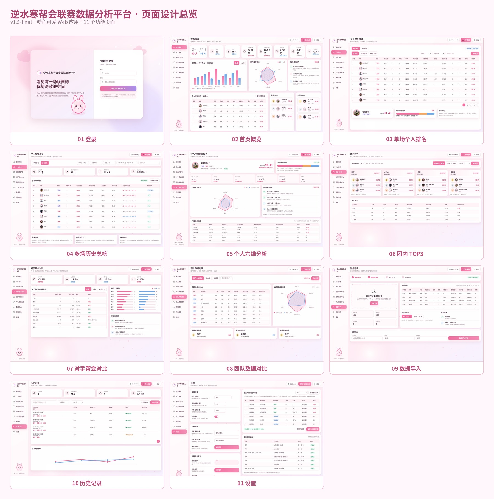

### 6.1 登录页

设计图：`design/png/00_login.png`

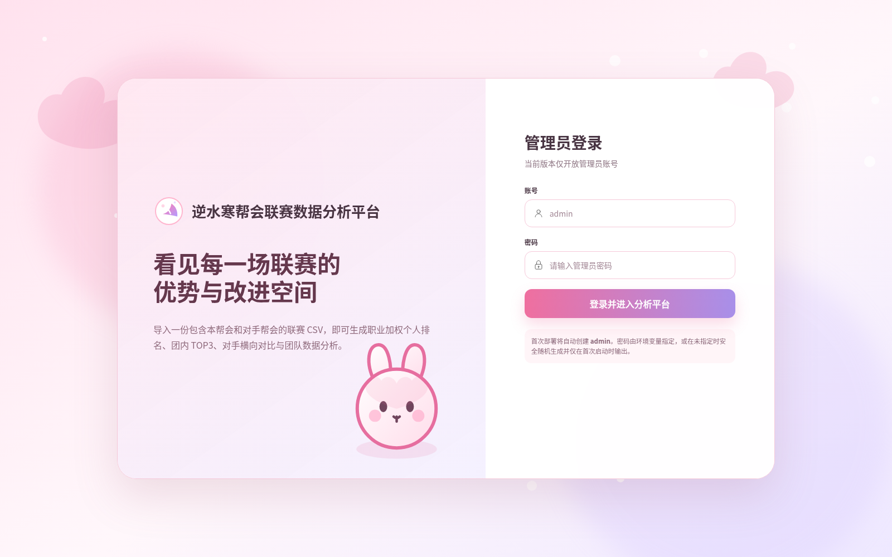

功能：

- 管理员账号、密码输入；
- 登录失败采用统一提示，不暴露账号是否存在；
- 首次部署账号说明；
- 若 `force_password_change=true`，登录后强制进入修改密码流程；
- 不显示注册入口。

### 6.2 首页概览

设计图：`design/png/01_overview.png`

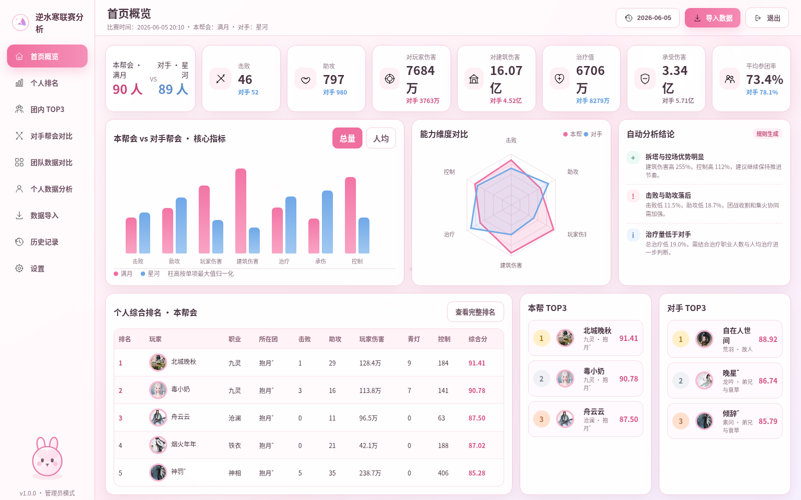

功能：

- 显示当前比赛、本帮会、对手、人数；
- 显示双方击败、助攻、玩家伤害、建筑伤害、治疗、承伤、参团等关键指标；
- 支持总量和人均切换；
- 柱状图与雷达图对比；
- 自动生成优势、不足、需关注项；
- 本帮会个人 TOP3 和对手个人 TOP3；
- 本帮会个人排名摘要。

### 6.3 个人综合排名

设计图：`design/png/02_personal_ranking.png`

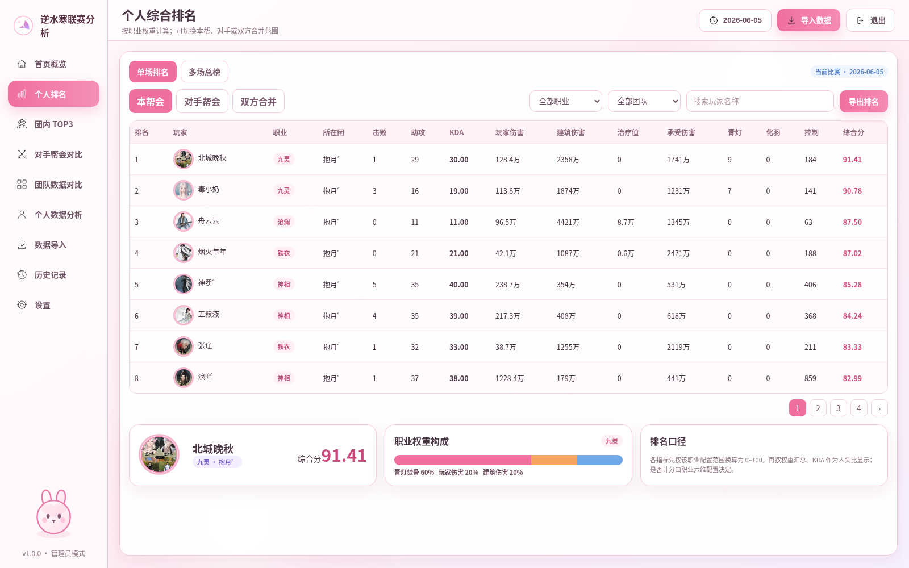

功能：

- 顶部提供“单场排名 / 多场总榜”模式切换；
- 单场范围：本帮会、对手帮会、双方合并；
- 多场总榜范围：日期区间、帮会、职业、最低参赛场次和玩家名；
- 单场榜显示全部原始指标、派生指标和综合得分；
- 多场榜显示参赛场次、场均综合分、累计贡献分、最近一场得分和趋势；
- 多场榜默认按场均综合分降序，累计贡献分仅作为辅助排序项；
- 点击玩家进入详情；
- 解释当前职业评分构成及所用规则版本；
- 支持分页、排序和导出当前榜单图片。

多场总榜设计图：`design/png/02b_multi_match_ranking.png`

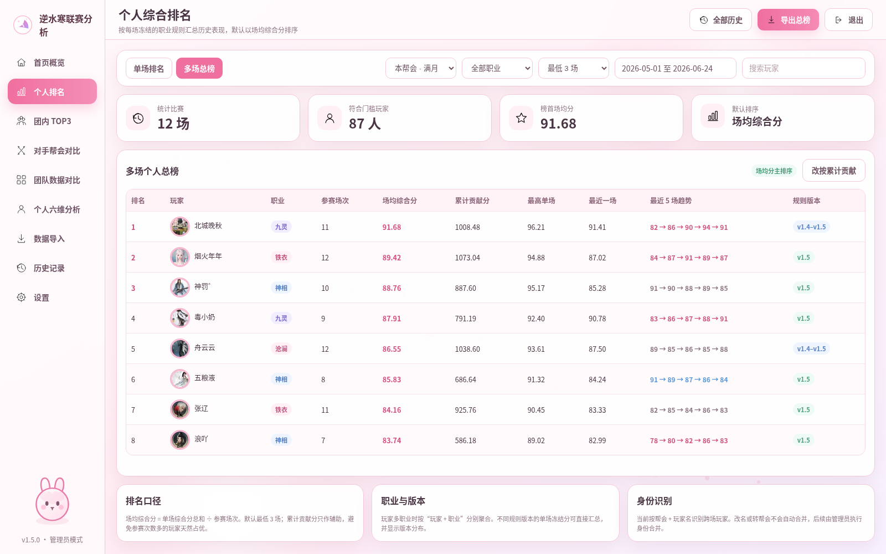

### 6.4 个人数据详情与六维分析

设计图：`design/png/03_player_detail.png`

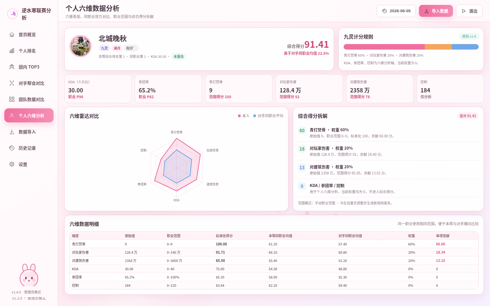

功能：

- 玩家基本信息、帮会、职业、所在团；
- 本场综合排名、同职业排名和分团排名；
- 六维雷达图，固定显示该职业配置的 6 个分析槽位；
- 每个维度显示原始值、配置范围、标准化得分、排名权重和单项贡献分；
- 对比线包括：本人、本帮同职业平均、对手同职业平均；
- 可切换为同职业中位数、P75 或本帮会平均；
- 自动给出最高的 2 项优势、最低的 2 项不足，并附原始数据依据；
- 显示 KDA、参团率、玩家伤害占比、建筑伤害占比等辅助指标；
- 历史比赛趋势；
- 明确显示所使用的评分规则版本和范围版本；
- 玩家头像可在设置页替换，未设置时使用稳定随机头像。

### 6.5 团内 TOP3

设计图：`design/png/04_team_top3.png`

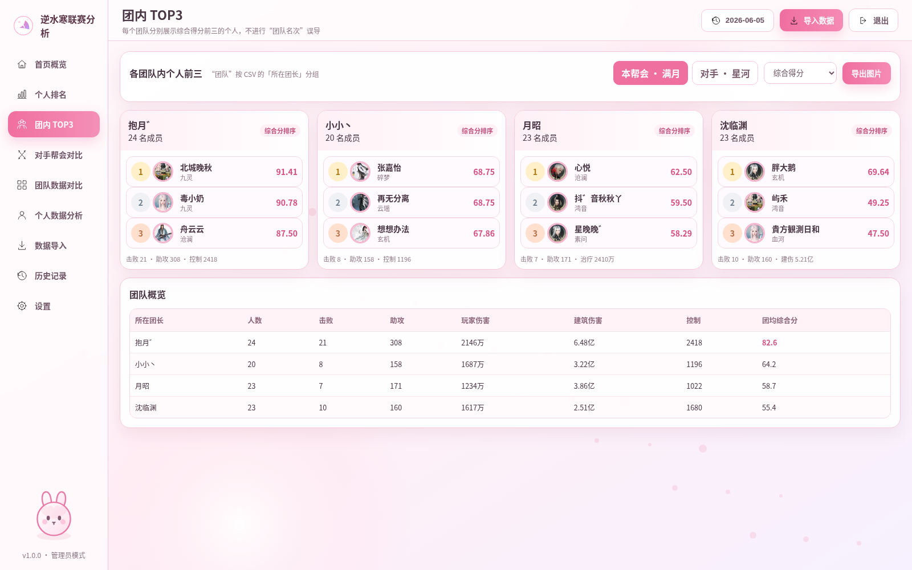

功能：

- 按 `所在团长` 分组；
- 每一个分团分别展示本团综合得分前三的个人；
- 显示分团人数和关键汇总；
- 可切换本帮会或对手帮会；
- 可按综合得分或指定单项指标选出 TOP3；
- 不把各分团误称为“团队总排名”。

### 6.6 对手帮会横向对比

设计图：`design/png/05_opponent_comparison.png`

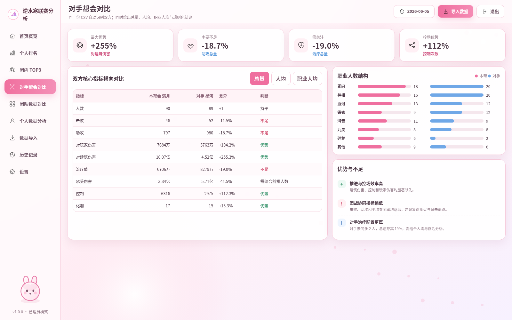

功能：

- 双方总量、人均、职业人均对比；
- 差值、差异百分比和判断标签；
- 职业人数结构；
- 最大优势、主要不足、需关注项；
- 对“承受伤害”等方向不明确的指标不做简单好坏判断；
- 支持查看形成结论所依据的数据。

### 6.7 团队数据对比

设计图：`design/png/06_squad_comparison.png`

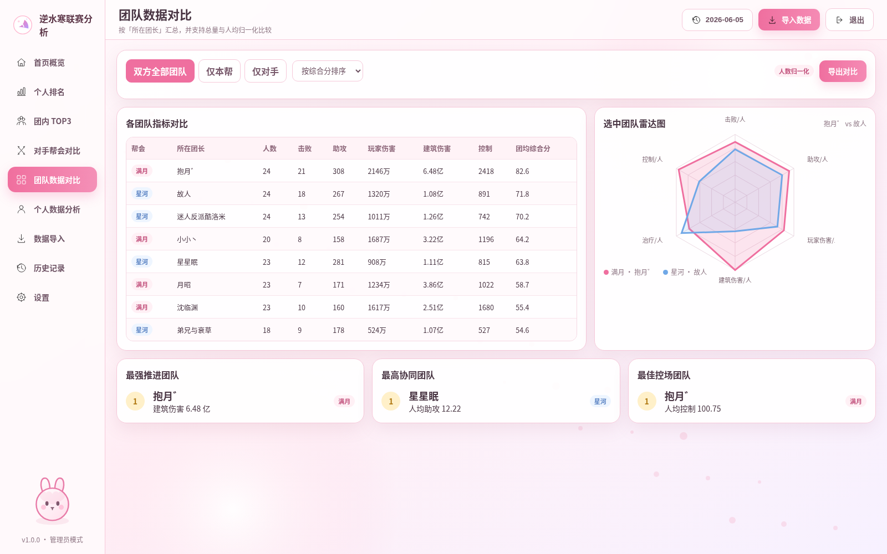

功能：

- 汇总双方全部分团；
- 支持仅本帮、仅对手、双方全部；
- 支持总量和人均比较；
- 两个选中分团雷达对比；
- 展示推进、协同、控场等单项表现较高的分团；
- 人数差异较大时默认优先展示人均数据。

### 6.8 数据导入

设计图：`design/png/07_data_import.png`

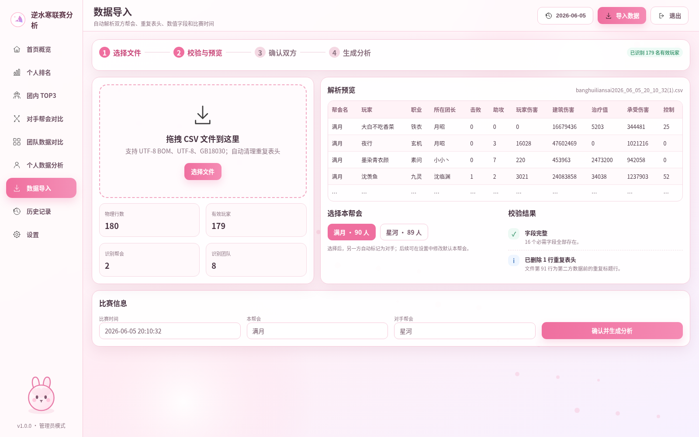

流程：

1. 上传或拖拽 CSV；
2. 自动检测编码；
3. 清洗重复表头；
4. 检查字段和数值；
5. 识别帮会、职业、分团；
6. 推断比赛时间；
7. 管理员选择本帮会；
8. 预览警告和错误；
9. 确认后写入数据库并生成分析。

### 6.9 历史记录

设计图：`design/png/08_history.png`

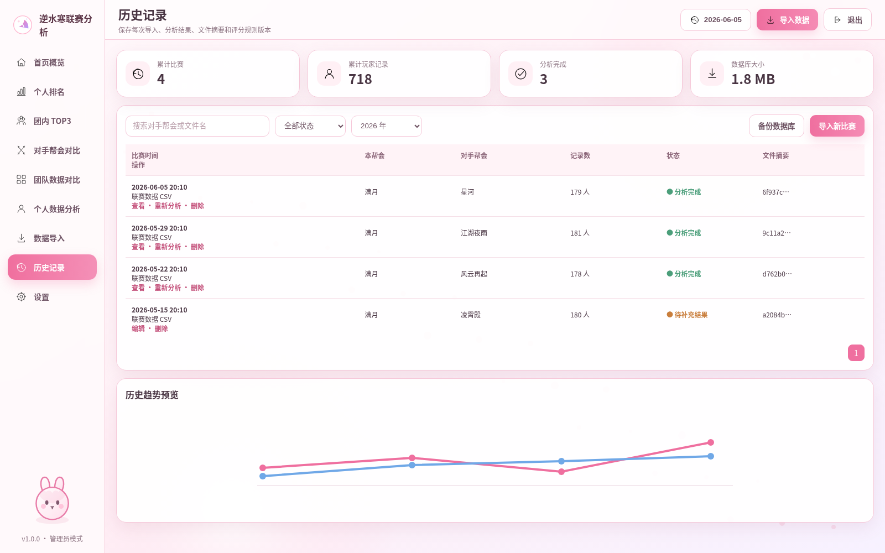

功能：

- 比赛时间、本帮会、对手、记录数、状态、文件摘要；
- 查看、重新分析、编辑元数据、删除；
- SHA-256 防止重复导入；
- 历史趋势预览；
- 手动备份数据库。

### 6.10 设置

设计图：`design/png/09_settings.png`

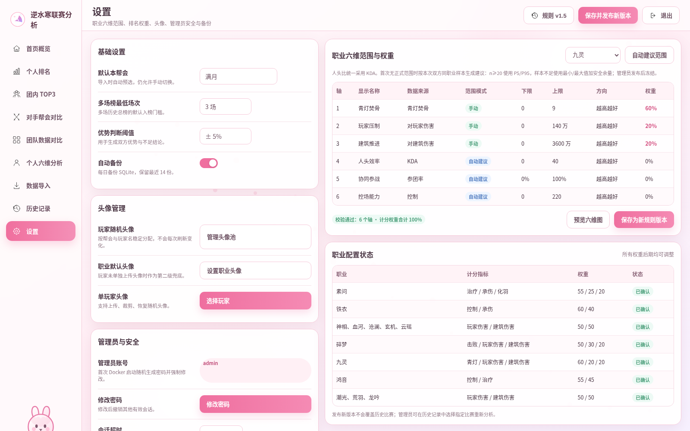

功能：

- 默认本帮会；
- 优势/不足判断阈值；
- 时区、自动备份和保留天数；
- 管理员密码和会话时长；
- 每个职业固定 6 个分析槽位，集中管理职业六维范围和权重；
- 每个槽位可选择原始或派生指标、显示名称、下限、上限、方向、是否计入排名及排名权重；
- 权重总和实时校验，参与排名的权重必须合计 100%；
- 支持根据历史数据自动建议范围，并允许人工覆盖；
- 首次无正式范围时，按当前导入文件中双方同职业样本生成建议；发布后锁定，只有管理员创建新范围版本才会变化；
- 可配置多场总榜的默认最低参赛场次，默认值为 3；
- 职业评分规则版本管理；
- 玩家头像管理：查看随机头像、上传替换、恢复随机头像；
- 职业默认头像管理；
- 每次规则修改生成新版本，不覆盖历史规则；
- 提供“用新规则重新分析指定比赛”操作和影响预览。

原型 HTML 位于 `design/html/`，可直接作为视觉和布局参考，但不应直接当作正式前端代码。

## 7. 视觉与资源规范

### 7.1 视觉方向

- 风格：可爱、轻盈、粉色、适度游戏感；
- 主色：粉红；
- 对手色：低饱和蓝色；
- 优势：绿色；
- 不足：红/橙色；
- 不仅依赖颜色，还要同时使用文字和图标；
- 数据表格优先保证可读性，避免过度装饰。

建议色值：

| 用途 | 色值 |
|---|---|
| 主粉色 | `#EF6F9F` |
| 深粉色 | `#C9497A` |
| 浅粉背景 | `#FFF0F5` |
| 对手蓝 | `#70A8E7` |
| 优势绿 | `#62B992` |
| 警示橙 | `#F2A55F` |
| 正文 | `#493543` |
| 辅助文字 | `#8D7482` |

### 7.2 已生成资源

- 应用背景：`assets/backgrounds/`
- 品牌 Logo 和兔子吉祥物：`assets/brand/`
- 导航及指标图标：`assets/icons/`
- 原型角色头像：`assets/avatars/mockup_online/`
- 资源清单与 SHA-256：`assets/asset_manifest.json`
- 前期概念图：`references/concept_moodboards/`

图标同时提供 SVG、64px PNG、128px PNG。背景同时提供 SVG 和 PNG。

### 7.3 角色头像规则

头像分为三层：

1. 玩家自定义头像；
2. 根据“玩家名 + 固定服务器盐”生成的稳定随机头像；
3. 职业默认头像或通用人物图标兜底。

默认随机头像应满足：同一玩家在多次导入中保持一致、不同玩家尽量不同、不依赖联网、可由管理员重新生成。设置页允许为单个玩家上传 PNG/JPG/WebP，并可恢复为系统随机头像。

`assets/avatars/mockup_online/` 仅用于原型，不作为生产环境强依赖。正式版优先使用本项目生成的随机头像资源，避免未确认授权的第三方图片。

## 8. 数据导入规范

### 8.1 必需字段

| CSV 字段 | 内部字段 | 类型 | 用途 |
|---|---|---:|---|
| 帮会名 | guild_name | 文本 | 判断双方帮会 |
| 玩家 | player_name | 文本 | 玩家名称快照 |
| 等级 | level | 整数 | 展示、校验 |
| 职业 | career | 文本 | 评分规则和筛选 |
| 所在团长 | team_leader | 文本 | 分团标识 |
| 击败 | kills | 整数 | 排名与衍生指标 |
| 助攻 | assists | 整数 | 排名与参团率 |
| 战备资源 | logistics | 整数 | 保存，MVP 暂不计分 |
| 对玩家伤害 | player_damage | 64 位整数 | 输出与贡献率 |
| 对建筑伤害 | building_damage | 64 位整数 | 推进与贡献率 |
| 治疗值 | healing | 64 位整数 | 治疗职业评分 |
| 承受伤害 | damage_taken | 64 位整数 | 前排/治疗职业评分 |
| 重伤 | deaths | 整数 | 人头比/KDA |
| 青灯焚骨 | qingdeng | 整数 | 指定职业评分 |
| 化羽 | revive | 整数 | 素问等职业评分 |
| 控制 | control | 整数 | 控场表现 |

### 8.2 编码与格式

依次尝试：

1. UTF-8 with BOM；
2. UTF-8；
3. GB18030。

MVP 默认只正式支持 CSV。Excel 可作为待确认扩展。

### 8.3 清洗规则

- 去除字段名前后空格和不可见字符；
- 删除空白行；
- 删除重复表头行；
- 数字中的逗号、空格统一清理；
- 空数字按 0 处理，但产生警告；
- 非法数字阻止确认入库，并给出行号和字段；
- 玩家名、帮会名、职业、所在团长为空时视为错误；
- 原始值与清洗后值均应可追踪；
- 不因数值极大而自动删除，异常值只提示。

重复表头判定建议：一行中至少 80% 的单元格与对应列名相同。

### 8.4 帮会识别

- 文件恰好有两个帮会：管理员选择其中一个为本帮会，另一个自动成为对手；
- 已设置默认本帮会且匹配成功：自动预选，但仍允许更改；
- 超过两个帮会：阻止入库并要求确认文件格式；
- 少于两个帮会：允许仅做单帮会分析还是直接阻止，需最终确认；MVP 建议阻止。

### 8.5 比赛时间

优先级：

1. 管理员手工填写；
2. 从文件名正则解析；
3. 文件修改时间作为最后兜底，但必须标记“推断时间”。

### 8.6 重复导入

- 对原文件计算 SHA-256；
- 相同摘要默认不重复写入；
- 管理员可选择覆盖元数据、重新分析或取消；
- 原始 CSV 可选保存到数据目录，默认建议保存，方便审计。

---

## 9. 派生指标定义

### 9.1 KDA（人头比）

```text
KDA = (击败 + 助攻) / max(重伤, 1)
```

- 系统中的“人头比”统一指 KDA；
- 重伤大于 0 时按实际重伤数计算；
- 重伤为 0 时使用分母 1 保存有限数值，并在界面增加“未重伤”标签；
- KDA 保留两位小数；
- K/D 不再作为主展示、默认排序或默认六维补足指标；
- KDA 可作为个人六维分析轴，默认权重为 0，管理员也可在职业规则中配置其参与综合分。

### 9.2 参团率

```text
参团率 = (个人击败 + 个人助攻) / 所在帮会击败总数
```

若所在帮会击败总数为 0，参团率返回 0。参团率按本帮会和对手帮会分别计算，不能混用双方总击败。

### 9.3 伤害占比

```text
玩家伤害占比 = 个人对玩家伤害 / 所在帮会对玩家伤害总和
建筑伤害占比 = 个人对建筑伤害 / 所在帮会对建筑伤害总和
```

这两项只用于描述个人在本方总量中的份额，不等于综合分贡献，也不再命名为“转化率”。

### 9.4 职业指标标准化

每个职业、每个六维槽位均可配置下限和上限。默认线性换算：

```text
正向指标得分 = clamp((实际值 - 下限) / (上限 - 下限), 0, 1) × 100
反向指标得分 = clamp((上限 - 实际值) / (上限 - 下限), 0, 1) × 100
```

- 下限等于上限时规则无效，禁止保存；
- 超出范围的值截断为 0 或 100，但保留原始值；
- 某职业首次没有已发布范围时，使用当前导入文件中双方帮会的同职业样本生成建议；
- 同职业有效样本数 `n ≥ 20` 时，建议下限/上限采用 P5/P95；
- `3 ≤ n < 20` 时，采用最小值/最大值，并在两端增加跨度的 10% 安全余量；
- `n < 3` 时仍给出最小值/最大值建议，并使用“数值绝对值的 10% 或指标最小安全步长（二者取大）”扩展两端，同时明显标记样本不足；
- 所有自动建议都不得自动发布，必须由管理员确认；
- 范围发布后形成不可变版本，新导入比赛继续使用当前已发布版本，不因新增数据自动变化；
- 管理员可在设置页基于历史同职业数据重新生成建议并发布新版本；历史比赛只有显式执行“使用新规则重新分析”时才改变派生得分；
- 同场双方同职业百分位仅用于对比展示，不代替正式范围得分。

### 9.5 玩家伤害转化率

```text
玩家伤害转化率 = 对玩家伤害在当前职业配置范围内的标准化得分 / 100
玩家伤害加权贡献 = 玩家伤害转化率 × 该职业玩家伤害权重
```

若该职业未启用“对玩家伤害”作为评分维度，仍可展示转化率，但加权贡献为 0。

### 9.6 拆塔伤害转化率

```text
拆塔伤害转化率 = 对建筑伤害在当前职业配置范围内的标准化得分 / 100
拆塔伤害加权贡献 = 拆塔伤害转化率 × 该职业建筑伤害权重
```

若该职业未启用“对建筑伤害”作为评分维度，仍可展示转化率，但加权贡献为 0。

### 9.7 分团人均指标

```text
分团人均指标 = 该分团指标总和 / 分团有效人数
```

双方分团人数不一致时，默认用人均进行主比较，总量作为辅助。

## 10. 个人综合排名与六维算法

### 10.1 总体原则

原始数值不能直接跨职业相加。系统将“个人六维分析”和“综合排名”分开处理：

- 六维分析负责完整展示一个玩家的六个职业相关能力维度；
- 综合排名只使用六个槽位中被标记为“参与排名”的维度；
- 参与排名的权重合计必须为 100%；
- 所有指标先按该职业配置范围转换到 0～100，再加权得到统一综合分。

### 10.2 六维分析槽位

每个职业固定配置 6 个槽位。每个槽位包含：

| 字段 | 说明 |
|---|---|
| `metric` | 击败、助攻、玩家伤害、建筑伤害、治疗、承伤、青灯焚骨、化羽、控制、KDA、参团率之一 |
| `label` | 页面显示名称 |
| `min` / `max` | 该职业该指标的有效范围 |
| `direction` | `higher` 或 `lower` |
| `ranking_weight` | 0～1；为 0 时仅分析展示，不参与总分 |
| `enabled` | 是否在六维图中显示 |

六维必须正好启用 6 个槽位。允许其中部分权重为 0，因此素问可以展示 6 个维度，但综合分只采用治疗、承伤、化羽。

### 10.3 综合得分

```text
维度得分 = 按职业范围标准化后的 0～100 分
单项贡献分 = 维度得分 × 排名权重
综合得分 = 所有参与排名维度的单项贡献分之和
```

综合分范围为 0～100，保留两位小数。

### 10.4 已确认职业规则

| 职业 | 综合分公式 |
|---|---|
| 素问 | 治疗得分×55% + 承伤得分×25% + 化羽得分×20% |
| 铁衣 | 控制得分×60% + 承伤得分×40% |
| 神相 | 玩家伤害得分×50% + 建筑伤害得分×50% |
| 血河 | 玩家伤害得分×50% + 建筑伤害得分×50% |
| 沧澜 | 玩家伤害得分×50% + 建筑伤害得分×50% |
| 玄机 | 玩家伤害得分×50% + 建筑伤害得分×50% |
| 云瑶 | 玩家伤害得分×50% + 建筑伤害得分×50% |
| 碎梦 | 击败得分×50% + 玩家伤害得分×30% + 建筑伤害得分×20% |
| 九灵 | 青灯焚骨得分×60% + 玩家伤害得分×20% + 建筑伤害得分×20% |
| 鸿音 | 控制得分×55% + 治疗得分×45% |
| 潮光 | 玩家伤害得分×50% + 建筑伤害得分×50% |
| 荒羽 | 玩家伤害得分×50% + 建筑伤害得分×50% |
| 龙吟 | 玩家伤害得分×50% + 建筑伤害得分×50% |

潮光、荒羽、龙吟参照神相的正式评分模板：排名指标和权重一致，均为对玩家伤害 50% 与对建筑伤害 50%。为避免不同职业数值分布互相干扰，三个职业仍分别维护自己的六维上下限、范围版本和同职业比较基准。

### 10.5 六维默认展示补足

职业评分指标少于 6 项时，其余槽位使用辅助分析指标，默认建议：助攻、参团率、KDA、控制、承伤或职业特色指标。辅助槽位的排名权重为 0，管理员可在设置页替换。

示例：素问默认六维可为“治疗、承伤、化羽、助攻、参团率、KDA”，其中只有前三项参与综合分。

### 10.6 同职业对比

个人六维页面使用同一职业、同一评分范围进行比较，展示：

1. 玩家本人；
2. 本帮会同职业平均；
3. 对手帮会同职业平均；
4. 同场双方同职业百分位；
5. 样本不足提示。

不同职业的雷达轴可能不同，因此不直接把素问六维雷达与碎梦六维雷达叠加比较；跨职业只比较统一的综合分。

### 10.7 排名范围

系统同时维护：

- 本帮会单场总排名；
- 对手帮会单场总排名；
- 双方合并单场总排名；
- 同职业单场排名；
- 分团内部单场排名；
- 指定日期区间内的本帮会多场总榜；
- 指定日期区间内的对手帮会多场总榜。

页面默认展示当前比赛的本帮会单场总排名；切换到“多场总榜”后，默认使用全部历史比赛、最低参赛 3 场、场均综合分降序。

### 10.8 多场历史总榜算法

同一玩家跨场识别暂按“帮会 ID + 玩家名称”进行；玩家改名或转帮会不会自动合并，管理员后续可通过身份合并功能处理。

```text
参赛场次 = 日期范围内该玩家有效比赛记录数
场均综合分 = Σ单场综合分 / 参赛场次
累计贡献分 = Σ单场综合分
```

默认规则：

1. 最低参赛场次默认 3，设置页可调整，榜单页可临时筛选；
2. 主排序为场均综合分降序；
3. 累计贡献分仅作为辅助数据和可选排序，不作为默认排序；
4. 榜单同时显示最近一场得分、最高单场得分和最近 5 场趋势；
5. 某玩家跨场使用过不同评分版本时，默认直接使用每场已冻结的综合分，并在详情中标记版本分布；管理员可选择统一规则批量重新分析后再比较；
6. 职业筛选按每场职业记录统计；玩家多职业参赛时，默认按“玩家 + 职业”分别聚合，避免不同职业评分模型混合。

### 10.9 单场排名并列处理

1. 综合得分降序；
2. 该职业第一主指标得分降序；
3. 参团率降序；
4. KDA 降序；
5. 玩家名按 Unicode 升序。

### 10.10 可解释性与规则版本

必须保存：

- 评分规则版本；
- 六维范围版本；
- 每个槽位的原始值、范围、方向、标准化得分；
- 是否参与排名；
- 权重与单项贡献分；
- 最终综合分；
- 同职业比较样本数。

玩家详情页必须能够完整解释“为什么是这个分数”。

## 11. 本帮会与对手帮会分析

### 11.1 比较层级

1. 总量；
2. 人均；
3. 同职业人均；
4. 分团总量；
5. 分团人均；
6. 个人同职业；
7. 职业人数结构。

### 11.2 差异计算

```text
差异百分比 = (本帮会值 - 对手值) / max(|对手值|, ε)
```

对手为 0 时使用特殊显示，不直接产生无限百分比。

### 11.3 判断阈值

建议默认：

- 差异 ≥ +5%：优势；
- -5% < 差异 < +5%：持平；
- 差异 ≤ -5%：不足。

阈值可在设置中修改。

### 11.4 指标方向

| 指标 | 默认方向 |
|---|---|
| 击败、助攻、玩家伤害、建筑伤害、治疗、控制、化羽 | 越高越好 |
| 重伤 | 越低越好 |
| 承受伤害 | 中性，需结合职业和人数解释 |
| 参团率 | 越高越好 |

“承受伤害”可能代表前排承担充分，也可能代表队伍承压过高，不能仅凭总量自动判定优劣。

### 11.5 自动结论引擎

MVP 不依赖大模型，使用确定性规则：

1. 计算所有指标的总量、人均和职业人均差异；
2. 排除中性或样本不足指标；
3. 取差异最大的 3 个优势；
4. 取差异最小的 3 个不足；
5. 对治疗、承伤、职业人数等补充上下文；
6. 每条结论附数据依据；
7. 明确标记“规则生成”，避免被误认为人工战术结论。

---

## 12. 技术架构

### 12.1 正式技术栈

| 层级 | 方案 |
|---|---|
| 前端 | Vue 3 + TypeScript + Vite |
| 图表 | ECharts |
| 样式 | TailwindCSS + 组件化样式 |
| 后端 | Go + Gin |
| 数据处理 | Go 标准库 CSV + GB18030 解码 |
| ORM/模型 | Ent schema + SQL migration |
| 数据库 | PostgreSQL 15+ |
| 缓存/会话 | Redis 7+ |
| 数据库迁移 | 内置 SQL migration |
| 密码哈希 | Argon2id |
| 服务进程 | Go HTTP 服务 |
| 部署 | app/postgres/redis 三服务 Docker Compose |

依赖的具体版本在开发启动时写入 lockfile，不在本文固定死版本号。

### 12.2 生产形态

MVP 推荐 Docker Compose 独立部署：

- 构建阶段使用 Node 编译前端；
- 构建阶段使用 Go 编译后端；
- 运行阶段使用最小 Linux 镜像运行 Go 服务；
- Go/Gin 同时提供 `/api/*` 和前端静态文件；
- PostgreSQL、Redis、上传文件和备份目录均使用本项目独立 Docker volume；
- 宿主机默认暴露 `18080` 端口，容器内服务监听 `8080`。

### 12.3 架构图

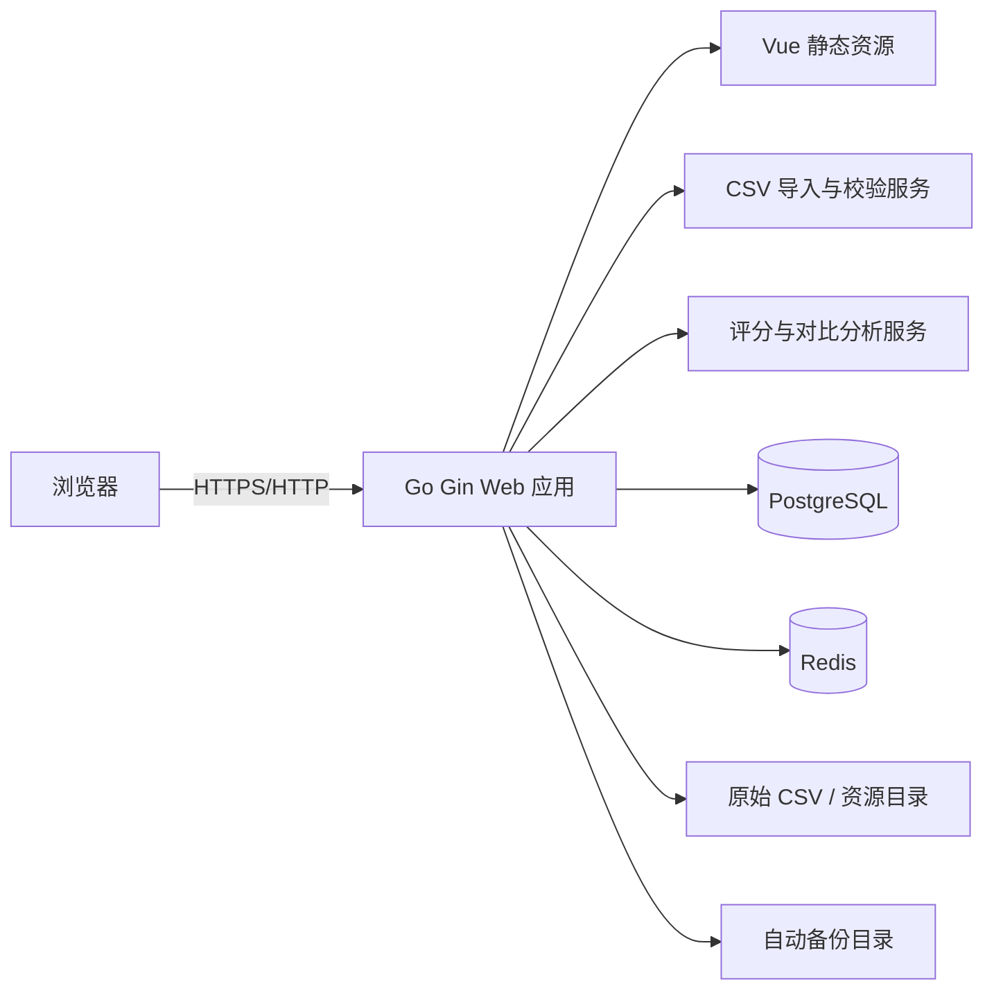

### 12.4 为什么选择 PostgreSQL + Redis

- 需求已调整为参考 `sub2api` 的独立 Docker Compose 体验；
- PostgreSQL 适合保存比赛、玩家、统计、规则版本、范围版本和审计数据；
- Redis 用于会话、登录失败限流和导入预览缓存；
- 本项目 Compose 默认启动独立 PostgreSQL/Redis，不复用宿主机已有实例，避免影响其他项目；
- 卸载默认保留 Docker volume，只有显式 `REMOVE_DATA=true` 才删除数据。

生产环境如部署到公网，建议在前方增加 HTTPS 反向代理，并设置 `COOKIE_SECURE=true`。

---

## 13. 数据库设计

完整草案：`database/schema.sql`

主要实体：

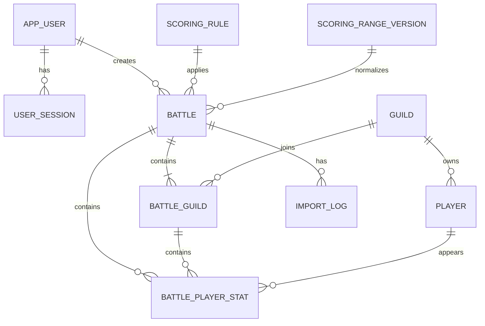

### 13.1 关键设计原则

- 比赛、帮会、玩家原始统计与派生结果分离；
- 保留玩家名、职业、所在团长快照；
- 评分规则版本与职业范围版本均随比赛保存；
- 文件摘要唯一，防止重复导入；
- 所有伤害数值使用 64 位整数；
- 派生指标使用 REAL；
- 分团不单独建立永久实体，MVP 使用 `team_leader_snapshot`，避免团长变化造成错误合并。

### 13.2 跨比赛玩家身份

MVP 使用：

```text
玩家身份候选键 = 帮会 ID + 玩家名称
```

玩家改名、换帮会或名称中字符变化会被视为新玩家。后续可增加别名合并功能。

---

## 14. 后端接口边界

接口草案：`api/openapi-outline.yaml`

主要接口：

| 路径 | 用途 |
|---|---|
| `POST /api/auth/login` | 管理员登录 |
| `POST /api/auth/logout` | 退出 |
| `GET /api/auth/me` | 当前登录状态 |
| `POST /api/auth/change-password` | 修改密码 |
| `POST /api/battles/import/preview` | 上传并预解析 |
| `POST /api/battles/import/confirm` | 确认后入库分析 |
| `GET /api/battles` | 历史列表 |
| `GET /api/battles/{id}/overview` | 首页概览 |
| `GET /api/battles/{id}/rankings` | 单场个人排名 |
| `GET /api/rankings/players/aggregate` | 多场历史总榜，支持日期、帮会、职业、最低场次和排序 |
| `GET /api/battles/{id}/players/{stat_id}` | 玩家详情、六维分析及同职业双方对比 |
| `GET /api/rankings/history` | 多场历史总榜，支持日期、帮会、职业、最低参赛场次、排序和分页 |
| `GET /api/battles/{id}/team-top3` | 各团内部前三 |
| `GET /api/battles/{id}/guild-comparison` | 双方帮会对比 |
| `GET /api/battles/{id}/squad-comparison` | 分团对比 |
| `POST /api/battles/{id}/reanalyze` | 重新分析 |
| `DELETE /api/battles/{id}` | 删除比赛 |
| `GET/PUT /api/settings` | 系统设置 |
| `GET/POST /api/scoring-rules` | 职业六维评分规则版本 |
| `POST /api/scoring-rules/validate` | 校验六个槽位、范围和权重 |
| `POST /api/scoring-rules/range-suggestions` | 生成职业范围建议 |
| `PUT/DELETE /api/players/{id}/avatar` | 替换或恢复玩家头像 |
| `PUT/DELETE /api/careers/{career}/avatar` | 管理职业默认头像 |
| `POST /api/backups` | 手动备份 |

所有业务接口除健康检查和登录外都需要认证。

---

## 15. 登录与安全

### 15.1 首次部署自动创建管理员

启动顺序：

1. 创建数据目录；
2. 执行数据库迁移；
3. 检查是否已有用户；
4. 无用户时创建用户名固定为 `admin` 的管理员；
5. 生成至少 20 位的高强度随机密码，不允许内置默认弱密码；
6. 只在首次成功创建管理员的容器日志中显示一次；
7. 密码只以 Argon2id 哈希保存；
8. 后续重启不得再次输出、重置或重新生成密码；
9. 首次登录强制修改密码；
10. 若挂载卷中已存在管理员数据，则初始化逻辑必须幂等跳过。

首次部署不通过 `.env` 设置固定管理员密码，统一由启动程序随机生成。若首次日志丢失，使用容器内密码重置命令生成新的临时密码。

### 15.2 会话

- 使用服务端会话或随机令牌；
- Cookie 设置 `HttpOnly`、`SameSite=Lax`；
- HTTPS 部署时设置 `Secure`；
- 默认 8 小时过期；
- 修改密码后使其他会话失效；
- 退出时撤销会话。

### 15.3 登录保护

- 单 IP 15 分钟最多 5 次失败；
- 统一错误提示；
- 记录登录成功、失败和密码修改审计日志；
- 日志中不得记录明文密码和完整会话令牌。

### 15.4 CSRF 与上传安全

- Cookie 登录必须增加 CSRF 防护；
- 上传限制扩展名、MIME、大小；
- 文件名重新生成，禁止路径穿越；
- CSV 只解析文本，不执行内容；
- 导出 CSV/Excel 时防止公式注入。

---

## 16. Docker 部署

示例文件：

- `deployment/docker-compose.example.yml`
- `deployment/Dockerfile.example`
- `deployment/.env.example`

### 16.1 目录建议

```text
project/
├─ frontend/
├─ backend/
├─ deployment/
├─ assets/
├─ data/                 # 上传文件目录，挂载卷
├─ backups/              # 备份，挂载卷
├─ Dockerfile
├─ docker-compose.yml
└─ .env
```

### 16.2 启动

```bash
cp .env.example .env
# 编辑 .env，至少替换 POSTGRES_PASSWORD 和 SESSION_SECRET；管理员初始密码由程序随机生成
docker compose up -d --build
```

访问：

```text
http://服务器地址:18080
```

通过首次启动日志获取随机密码：

```bash
docker compose logs app
```

随机密码只在首次创建管理员时输出，后续重启不能再次输出或重置。若日志丢失，使用容器内管理命令重新生成临时密码。

### 16.3 持久化

- `postgres_data`：PostgreSQL 数据卷；
- `redis_data`：Redis 数据卷；
- `/app/data/uploads/`：原始 CSV；
- `/app/backups/`：自动备份；
- 容器删除后挂载目录仍保留。

### 16.4 健康检查

```text
GET /api/health
```

返回数据库可用、应用版本和迁移状态，不返回敏感信息。

### 16.5 公网部署

如部署到公网，必须在前方增加 HTTPS 反向代理，并将 `COOKIE_SECURE=true`。反向代理可以使用现有网关、Caddy 或 Nginx，MVP 不要求把代理强制放入同一 Compose。

---

## 17. 备份与恢复

### 17.1 自动备份

- 默认每日一次；
- 使用 PostgreSQL 逻辑备份或元数据备份；
- 默认保留 14 份；
- 文件名包含时间；
- 备份完成后做完整性检查。

### 17.2 手动备份

设置页和历史页提供“立即备份”。

### 17.3 恢复

恢复属于高风险操作，MVP 可先提供命令行流程，不一定开放网页按钮：

1. 停止容器；
2. 备份当前数据库；
3. 将指定备份按恢复脚本或 `psql` 导入 PostgreSQL；
4. 启动容器；
5. 检查健康接口和数据记录。

---

## 18. 性能与非功能要求

### 18.1 性能目标

在单场 500 名玩家、历史 200 场以内：

- CSV 预览：3 秒内；
- 确认导入与分析：10 秒内；
- 排名和对比页面：常规请求 1 秒内；
- 首屏加载：局域网环境 2 秒内。

### 18.2 兼容性

- 优先支持最新版 Chrome、Edge；
- 桌面端优先；
- 1280 宽度以下允许出现横向滚动；
- 不要求 IE。

### 18.3 可维护性

- 所有职业权重配置化；
- 所有统计口径集中在分析模块；
- 每个规则都有版本号；
- 数据导入、清洗、评分分别编写测试；
- 不在前端重复实现核心计算。

### 18.4 可观察性

- 结构化日志；
- 每次导入生成 import ID；
- 错误日志包含文件摘要、行号、字段，不包含敏感密码；
- 健康检查；
- 可查看应用版本和数据库迁移版本。

---

## 19. 测试要求

### 19.1 导入测试

- UTF-8 BOM；
- UTF-8；
- GB18030；
- 中间重复表头；
- 空行；
- 数字含逗号；
- 缺列；
- 多帮会或单帮会；
- 重复文件；
- 非法数字；
- 文件名无法解析时间。

### 19.2 计算测试

- 除零；
- 重伤为 0；
- 帮会击败为 0；
- 同职业只有 1–4 人；
- 相同值并列；
- 职业范围下限等于上限；
- 数值低于下限或高于上限；
- 六维槽位不足或超过 6 个；
- 权重不等于 100%；
- 素问辅助维度权重误设为非 0；
- 重新分析后规则版本变化；
- 大整数伤害不溢出；
- 首次范围建议在 n≥20、3≤n<20、n<3 三种样本量下符合规则；
- 已发布范围不会因新比赛导入自动改变；
- 多场榜最低场次、场均分和累计贡献分计算正确。

### 19.3 权限测试

- 未登录无法访问业务接口；
- 无注册接口；
- 登录失败限流；
- 修改密码后旧会话失效；
- 首次密码强制修改；
- Cookie 安全属性。

### 19.4 页面验收

- 设计图主要布局和颜色一致；
- 表格列不丢失；
- 本帮与对手颜色稳定；
- 团内 TOP3 按每团分别显示；
- 所有综合分可展开解释；
- 优势/不足结论均有数据依据；
- 头像缺失有兜底。

---

## 20. 验收标准

MVP 完成需要同时满足：

1. Docker Compose 可在全新环境启动；
2. 首次启动自动创建 `admin`，生成随机密码并只在首次日志显示；
3. 首次登录强制修改密码，无注册入口和注册接口；
4. 能成功导入当前样例 CSV；
5. 自动删除其中 1 行重复表头，保留 179 名玩家；
6. 能识别满月 90 人、星河 89 人和 8 个分团；
7. 管理员能选择本帮会；
8. 能分别查看本帮会与对手个人排名；
9. 人头比按 KDA 展示，参团率按已确认公式计算；
10. 玩家伤害/建筑伤害占比与职业区间转化率分开显示；
11. 每个职业可配置正好 6 个分析维度及各自范围；
12. 个人详情可显示六维雷达、单项得分、同职业本帮平均和对手平均；
13. 素问综合分只使用治疗 55%、承伤 25%、化羽 20%；
14. 样例中的十三个职业均按第 10.4 节正式规则参与完整总排名；
15. 导入未知或未来新增职业时必须提示未配置，且不得静默套用其他职业规则；
16. 能查看每个分团的个人 TOP3；
17. 能查看双方总量、人均和职业人均对比；
18. 能自动生成优势、不足及数据依据；
19. 能修改职业六维范围与权重并生成新规则版本；
20. 首次无正式范围时能按双方同职业样本生成建议，管理员确认发布后范围保持冻结；
21. 能按日期范围生成多场个人总榜，默认按场均综合分排序，并支持最低参赛场次过滤与累计贡献分展示；
22. 玩家默认有稳定随机头像，管理员可上传替换；
23. 能保存历史比赛并防止重复导入；
24. PostgreSQL 数据在容器重建后仍保留；
25. 自动备份可用；
26. 页面视觉符合粉色可爱设计基线。

## 21. 开发阶段建议

### 阶段 1：项目骨架与登录

- 前后端工程；
- PostgreSQL migration 与 Ent schema；
- 首次 admin 初始化；
- 登录、会话、修改密码；
- Docker 开发与生产构建。

### 阶段 2：导入与数据模型

- CSV 编码检测；
- 清洗与字段校验；
- 预览和本帮会选择；
- 比赛、帮会、玩家统计入库；
- 文件摘要和导入日志。

### 阶段 3：分析引擎

- 派生指标；
- 职业范围归一化；
- 每职业六维配置；
- 职业权重；
- 综合得分与评分解释；
- 团内 TOP3；
- 双方对比和自动结论。

### 阶段 4：全部页面

- 首页；
- 单场排名与多场总榜；
- 玩家详情与六维分析；
- 团内 TOP3；
- 对手对比；
- 分团对比；
- 历史；
- 设置。

### 阶段 5：测试与部署

- 单元测试；
- 样例数据回归；
- 安全检查；
- 备份恢复演练；
- Docker 部署文档；
- 验收。

---

## 22. 当前确认状态与默认实现

当前样例包含的十三个职业均已有正式评分规则，已不存在阻塞完整总排名的职业配置项。潮光、荒羽、龙吟参照神相的指标与权重，但各自保留独立的六维范围配置。

未来若游戏新增职业，系统仍应在导入预览中提示“职业规则未配置”，禁止自动套用其他职业。

### 22.1 可直接采用的默认实现

| 项目 | 默认实现 |
|---|---|
| 六维模型 | 每职业固定 6 个槽位；评分项不足 6 个时用助攻、参团率、KDA 等零权重辅助维度补足 |
| 范围换算 | 首次使用双方同职业样本；n≥20 用 P5/P95，样本不足用最小/最大值加安全余量；管理员发布后冻结 |
| 单场与历史 | MVP 同时提供单场排名和多场总榜；多场默认按场均综合分排序，最低参赛 3 场，累计贡献分仅辅助展示 |
| 本帮会识别 | 导入时从两个帮会中选择，并记住最近选择 |
| 团队分组 | 使用 CSV `所在团长` 字段，每个分团显示前三个人 |
| 零重伤 KDA | 使用分母 1 计算有限值，并显示“未重伤”标签 |
| 头像 | 玩家稳定随机头像；设置页支持单玩家替换和职业默认头像 |
| 管理员密码 | `admin` + 首次启动随机密码，只在首次 Docker 日志显示并强制修改 |
| 单帮会文件 | MVP 阻止入库，要求同一文件包含本帮与对手 |
| 原始文件 | 保存并使用 SHA-256 防重复导入 |

以上口径均已确认，无剩余阻塞开发的业务确认项。

## 23. 交付目录

```text
nsh_guild_analytics_spec_v4/
├─ 逆水寒帮会联赛数据分析平台_开发说明_v4.md
├─ README.md
├─ design/
│  ├─ png/                    # 11 张页面设计图与总览图
│  └─ html/                   # 可打开的静态原型
├─ assets/
│  ├─ backgrounds/            # SVG/PNG 背景
│  ├─ icons/                  # SVG、64px PNG、128px PNG
│  ├─ brand/                  # Logo、吉祥物
│  ├─ avatars/                # 原型头像与授权说明
│  └─ asset_manifest.json
├─ references/
│  └─ concept_moodboards/     # 前期概念效果图
├─ data/
│  ├─ sample_battle.csv
│  └─ sample_profile.json
├─ config/
│  ├─ scoring_rules.example.json
│  └─ import_aliases.example.json
├─ database/
│  └─ schema.sql
├─ api/
│  └─ openapi-outline.yaml
└─ deployment/
   ├─ docker-compose.example.yml
   ├─ Dockerfile.example
   └─ .env.example
```

---

## 24. 结论

现有需求已经定稿，可直接启动登录、导入、数据库、个人六维分析、双方对比、职业评分、单场排名、多场总榜和 Docker 部署开发。KDA、参团率、十三个职业评分模板、职业范围初始化与冻结机制均已确认。当前无需要继续向需求方确认的阻塞项。
